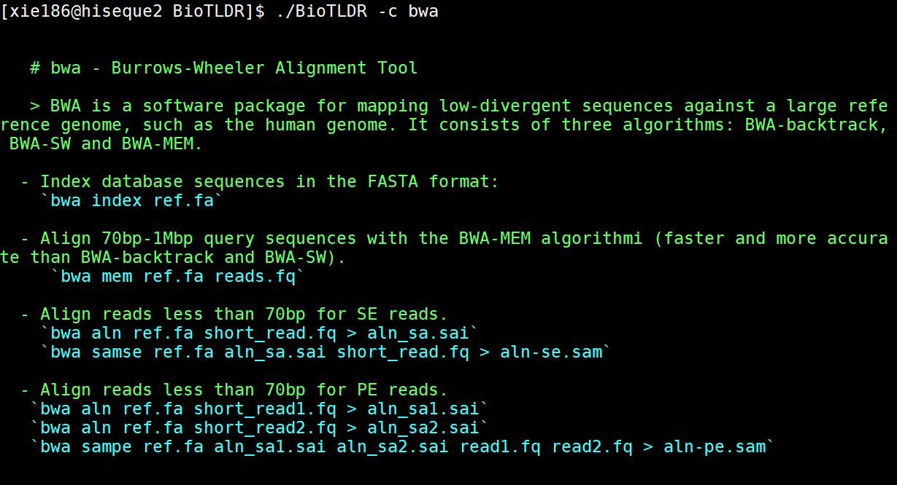
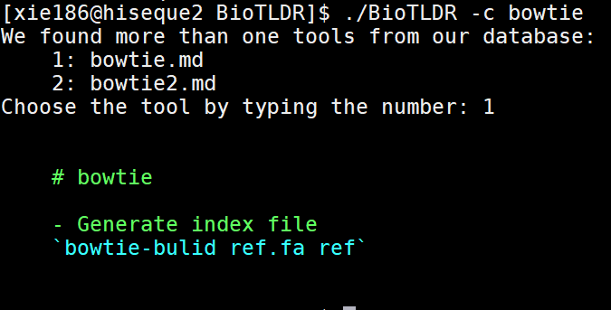

# BioTLDR: Simplified and community-driven help messages for tools in bioinformatics

> Still under development

Have you ever encontered the situation below in the process of bioinformatics analysis?


Lots of times, we need to go back to privious old project to see what command line we used. Or we need to read the help message or sometimes the manual again to figure out how we can run the command. This will consume a large amount of time.  

BioTLDR is developped to solve this problem. You can just simply type `BioTDLR -c <command>`, you can get the simplified help messages. Here are two examples: 






## How to install

```
git clone https://github.com/xie186/BioTLDR.git
cd BioTLDR
pip install -r required_package.txt 
```

## What if you tool is not included

You can fork this repo and add the corresponding markdown files. 

An example can be got [here](https://github.com/xie186/BioTLDR/edit/master/database/bwa.md)

Or you can submit an issue [here](https://github.com/xie186/BioTLDR/issues). 

## Suggestions

Please submit an issue [here](https://github.com/xie186/BioTLDR/issues) if you have any suggestions.

## TODO list

1. Wrap the terminal output

2. Add software notes

3. Add function to customize the markdown files
